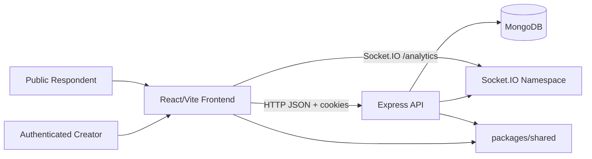

# Pulse Board Project Documentation

This document describes the current shipped implementation of Pulse Board. It is written for judges, future developers, and deployment maintainers.

## 1. Product Idea

Pulse Board is a real-time polling platform. A creator signs in, builds a poll, shares a public link, collects single-choice responses, watches response analytics update live, and publishes the final results when ready.

The product is designed around these use cases:

- A creator needs a fast way to build a poll with one or more single-choice questions.
- Respondents need a simple public link that works without friction for anonymous polls.
- Authenticated polls should only accept responses from signed-in users.
- The creator needs live feedback, including counts, completion/drop-off metrics, response timing, and a speed-based leaderboard.
- Published results should reuse the same public poll URL and show final aggregated results.

## 2. Shipped Solution

The shipped solution is a TypeScript monorepo with three workspace packages:

- `frontend`: React/Vite application for creators and respondents.
- `backend`: Express API, MongoDB persistence, auth, and Socket.IO realtime layer.
- `packages/shared`: Zod schemas, wire types, constants, and error codes shared by frontend and backend.

At runtime:

1. Creators authenticate with email/password.
2. Creators create active or draft polls.
3. Public respondents open `/p/:id`.
4. Responses are validated against the poll schema and persisted.
5. Complete responses update an aggregate read model transactionally.
6. Socket.IO emits live analytics deltas to subscribed dashboards.
7. Creators can publish results, which closes submissions and makes results visible on the public link.

## 3. Architecture



The backend is organized into layers:

- `routes`: HTTP route declarations and middleware composition.
- `services`: business workflows such as auth, poll mutation, public responses, analytics, and realtime emission.
- `repositories`: Mongoose access helpers.
- `domain`: Mongoose schemas and domain state helpers.
- `policies`: auth, validation, parameter validation, HTTP errors, and error mapping.
- `socket`: Socket.IO namespace setup and event emission helpers.

The frontend is organized by routes and local data helpers:

- `pages`: top-level route screens.
- `auth`: auth provider and route guard.
- `data/api`: Axios client and refresh-token retry behavior.
- `data/socket`: Socket.IO client singleton for analytics.
- `ui`: shared navigation, theme toggle, and error boundary.

## 4. pnpm Workspaces

`pnpm-workspace.yaml` defines:

```yaml
packages:
  - "packages/*"
  - "frontend"
  - "backend"
```

The root scripts coordinate package builds:

```bash
pnpm build
pnpm build:shared
pnpm dev:backend
pnpm dev:frontend
pnpm typecheck
```

The build order matters because both apps import `@pulse-board/shared`. The root `build` script builds shared first, then backend, then frontend.

## 5. Shared Folder Vision

`packages/shared` is the contract layer. It prevents frontend/backend drift by making validation and TypeScript wire types come from the same package.

It currently exports:

- `MAX_OPTIONS_PER_QUESTION`
- stable `ERROR_CODES`
- auth schemas
- common schemas such as ObjectId, poll status, response mode, and response status
- poll create/update/wire schemas
- public response submission schemas

Current examples:

- `createPollBodySchema` validates creator poll creation payloads.
- `updatePollBodySchema` validates partial poll updates.
- `submitPublicResponseBodySchema` validates public response submissions.
- `PollWire` defines the poll shape sent over the API.

This package is intentionally private and imported with `workspace:*`.

## 6. Core Domain Model

### User

Stores creator/respondent accounts:

- `email`: unique and indexed.
- `passwordHash`: bcrypt hash.
- `createdAt`: account creation timestamp.

### RefreshToken

Stores refresh-token sessions:

- `userId`
- `tokenHash`
- `replacedBy`
- `revokedAt`
- `expiresAt`
- `createdAt`

Refresh tokens are stored as hashes in MongoDB, not as plaintext.

### Poll

Polls embed questions and options directly inside the poll document:

- `ownerId`
- `title`
- `description`
- `expiresAt`
- `responseMode`: `anonymous` or `authenticated`
- `status`: `draft`, `active`, `expired`, or `published`
- `allowCreatorResponses`
- `allowResponseChanges`
- `timerSeconds`
- `timerMode`: `none`, `attached`, or `detached`
- `timerStartedAt`
- `questions`
- `deletedAt`
- timestamps

Embedded questions/options avoid extra joins for public poll loading and analytics display.

### Response

Responses store respondent answers:

- `pollId`
- `respondentId`: null for anonymous responses
- `status`: `partial` or `complete`
- `ipHash`
- `answers`
- `createdAt`

Indexes exist on `pollId`, `pollId + ipHash`, and `pollId + status`.

### Aggregate

The aggregate collection is the analytics read model:

- `pollId`
- `questionId`
- `optionId`
- `count`

There is a unique compound index on `pollId + questionId + optionId`. Complete response submissions increment these counters in a MongoDB transaction.

## 7. Auth and Session Flow

Auth uses HTTP-only cookies:

- `access_token`: JWT, 15 minute TTL.
- `refresh_token`: random token, 7 day TTL, stored hashed in MongoDB.
- `anon_session`: anonymous response deduplication cookie, 30 day TTL.

Supported auth endpoints:

- `POST /auth/register`
- `POST /auth/login`
- `POST /auth/logout`
- `POST /auth/refresh`
- `GET /auth/me`

Refresh-token rotation is implemented. When `/auth/refresh` succeeds, a new refresh token is created, the old token is marked revoked and replaced, and a fresh access token is issued.

The frontend Axios client retries one failed request after a `401` by calling `/auth/refresh`, except for login/register/refresh calls.

## 8. Poll Lifecycle

Poll statuses:

- `draft`: not public and cannot be published directly.
- `active`: public and accepting responses until expiry.
- `expired`: no longer accepting responses.
- `published`: responses are closed and public results are available.

Important rules:

- New polls can be created as active or draft.
- Draft polls can be activated from the editor.
- Poll metadata/questions cannot be modified after the first response, except timer-only metadata paths that the backend permits.
- Published polls cannot be modified.
- Polls with responses cannot be deleted.
- Deleted polls are soft-deleted with `deletedAt`.

Status is updated lazily. When a poll is read or acted on, the backend checks whether `expiresAt` should move an active poll to expired.

## 9. Timer Behavior

Polls can have no timer or one of two timer modes:

- `none`: no timer behavior.
- `attached`: the poll expiry is locked to `timerStartedAt + timerSeconds`.
- `detached`: the respondent UI auto-submits current answers when the timer reaches zero, while the poll expiry still controls whether the poll remains open.

The creator live dashboard and public respondent page both derive the countdown from server-stamped `timerStartedAt`, reducing client-side clock drift in the displayed timer.

## 10. Public Response Flow

Public route:

- `GET /public/polls/:id`: returns an active poll, or a published poll with summary.
- `POST /public/polls/:id/responses`: accepts partial or complete responses.

Submission behavior:

1. The backend loads the poll and applies lazy status updates.
2. Draft, expired, and published states are rejected for new submissions.
3. Answers are validated against embedded poll question/option IDs.
4. Complete submissions must include all required questions.
5. Authenticated polls require a valid access token.
6. Anonymous polls use `anon_session` cookie first, then IP/user-agent hash fallback.
7. Duplicate responses are rejected unless `allowResponseChanges` is enabled.
8. Complete responses update aggregate counts in a transaction.
9. Socket.IO emits deltas or snapshots after the transaction path.

Partial responses are best-effort. The public page sends partial responses on `beforeunload`, `pagehide`, and debounced blur/answer activity.

## 11. API Surface

Health:

- `GET /health`

Auth:

- `POST /auth/register`
- `POST /auth/login`
- `POST /auth/logout`
- `POST /auth/refresh`
- `GET /auth/me`

Owner polls:

- `POST /polls`
- `GET /polls`
- `GET /polls/:id`
- `PATCH /polls/:id`
- `DELETE /polls/:id`
- `PATCH /polls/:id/publish`

Public:

- `GET /public/polls/:id`
- `POST /public/polls/:id/responses`

Analytics:

- `GET /analytics/polls/:id`
- `GET /analytics/polls/:id/summary`
- `GET /analytics/polls/:id/leaderboard`

## 12. Analytics Implementation

Owner analytics returns:

- poll id and status
- total responses
- complete responses
- partial responses
- completion rate
- drop-off rate
- per-question option counts
- per-question option percentages
- per-question drop-off counts
- daily response-rate time series

Published public summary returns:

- complete response total
- per-question option counts
- per-question option percentages

Analytics reads aggregate counts from the aggregate collection, so the happy-path read does not need to scan every answer for option counts.

## 13. Live Dashboard

The live dashboard route is:

```text
/app/polls/:id/live
```

It displays:

- live status badge
- current question tab
- live single-choice bar chart
- countdown timer when configured
- total live responses
- speed-based leaderboard
- average score display

The live dashboard subscribes to the same Socket.IO analytics namespace as the analytics page. It applies incoming deltas directly to local UI state, and refreshes the leaderboard after each response.

## 14. Speed-Based Metrics

The leaderboard is speed-based, not accuracy-based. Options do not currently have correct/incorrect values.

Backend calculation:

1. Fetch complete responses for the poll.
2. Sort by `createdAt` ascending.
3. Keep the top 10.
4. Assign rank from fastest to slowest.
5. Compute score:

```ts
Math.round(((total - index) / total) * 500)
```

Example with two complete responses:

- rank 1: `500`
- rank 2: `250`

For authenticated polls, leaderboard names come from the email prefix. For anonymous polls, names are displayed as `Anonymous #rank`.

## 15. WebSocket Design

Socket.IO is attached to the same HTTP server as Express.

Namespace:

```text
/analytics
```

Room model:

- One namespace is used for all analytics traffic.
- Each poll uses a room named by `pollId`.
- Clients emit `join` with the poll id on connect.
- Clients emit `leave` on unmount.

Server events:

- `delta`
- `snapshot`

Delta payload:

```ts
{
  questionId: string;
  optionId: string;
  newCount: number;
  totalResponses: number;
}
```

Snapshot payload:

```ts
{
  pollId: string;
  totalResponses: number;
  questions: Array<{
    questionId: string;
    options: Array<{
      optionId: string;
      count: number;
      percentage: number;
    }>;
  }>;
}
```

Deltas are emitted after successful complete-response aggregate updates. Snapshots are used when replacing an existing complete response or when the aggregate fallback path recomputes counts.

The analytics page refetches via HTTP on reconnect so missed deltas are reconciled.

## 16. Delay and Performance Expectations

The system has several relevant delays:

### HTTP latency

The backend API is deployed on Cloud Run in `asia-south1`. Normal warm requests should usually complete in tens to low hundreds of milliseconds, depending on client location, MongoDB latency, Cloud Run instance warmth, and TLS/network path.

### WebSocket handshake delay

Socket.IO connection setup includes DNS, TLS, HTTP upgrade, namespace connection, and room join. Once connected, room broadcasts avoid repeat HTTP request overhead.

### WebSocket update delay

A live result update is emitted only after the response transaction commits. The visible delay is approximately:

```text
respondent POST latency
+ MongoDB write/transaction latency
+ aggregate update
+ Socket.IO room broadcast
+ browser event loop/render time
```

For small payloads and warm infrastructure, the server-side broadcast portion is expected to be low. End-to-end visible delay depends mostly on the respondent request and client network.

### Timer delay

Timers are displayed by comparing `Date.now()` with server-provided `timerStartedAt`. Display ticks update every second, so the UI can be up to roughly one tick behind. Attached timers rely on backend expiry checks, so server enforcement happens when the poll is read or a response is submitted.

### Partial response delay

Partial responses are best-effort and use `navigator.sendBeacon` on unload/pagehide plus debounced saves during interaction. These are intentionally not guaranteed with the same reliability as explicit complete submissions.

## 17. Measured Deployed Timings

Measured from this development workspace on 2026-05-13 against the deployed production URLs. Each HTTP number is 5 samples. These are point-in-time measurements, not an SLA.

| Target | URL | Status | Min | Avg | Max | Samples |
| --- | --- | ---: | ---: | ---: | ---: | --- |
| Frontend HTML | `https://pulseboard.sayantanbal.in/` | 200 | 52 ms | 152 ms | 550 ms | 550, 52, 54, 53, 53 |
| Backend health | `https://pulse-board-backend-600719163026.asia-south1.run.app/health` | 200 | 61 ms | 85 ms | 171 ms | 171, 64, 66, 65, 61 |
| Backend public miss | `/public/polls/000000000000000000000000` | 404 | 59 ms | 63 ms | 76 ms | 76, 59, 59, 60, 59 |
| Socket.IO websocket handshake | `/analytics` | connected | 194 ms | 208 ms | 225 ms | 225, 210, 194, 206, 207 |

The first sample is slower for frontend/backend HTTP because it includes colder connection setup. Subsequent samples are steadier.

## 18. Security Controls

Implemented controls:

- Passwords hashed with bcrypt.
- Access and refresh cookies are HTTP-only.
- Production cookies use `secure` and `sameSite: none`.
- Refresh tokens are rotated and stored as hashes.
- Protected owner routes require auth middleware.
- Zod validation runs on backend request bodies and route params.
- CORS is restricted by configured frontend origins in production.
- Anonymous deduplication uses an HTTP-only browser session cookie with IP/user-agent hash fallback.
- Auth write routes are rate-limited to 10 attempts per 15 minutes per IP.
- Auth read routes are rate-limited to 60 requests per 15 minutes per IP.
- Public response submission is rate-limited to 30 submissions per 10 minutes per IP.

## 19. Deployment

Current production deployment:

- Frontend: Firebase Hosting
- Backend: Google Cloud Run
- Database: MongoDB
- Frontend URL: `https://pulseboard.sayantanbal.in/`
- Backend URL: `https://pulse-board-backend-600719163026.asia-south1.run.app`

### Frontend Deployment

Firebase Hosting serves the Vite build output:

```text
frontend/dist
```

`firebase.json` rewrites all paths to `index.html`, which supports React Router browser routes.

Frontend production build env:

```bash
VITE_API_BASE=https://pulse-board-backend-600719163026.asia-south1.run.app
VITE_SOCKET_BASE=https://pulse-board-backend-600719163026.asia-south1.run.app
```

### Backend Deployment

The backend is containerized with the root `Dockerfile`.

Build stages:

1. Install workspace dependencies with pnpm.
2. Build `@pulse-board/shared`.
3. Build `@pulse-board/backend`.
4. Install production dependencies in the runner image.
5. Run `node backend/dist/server.js`.

Cloud Run uses:

```bash
PORT=8080
NODE_ENV=production
```

Required backend env:

```bash
MONGODB_URI=...
FRONTEND_ORIGIN=https://pulseboard.sayantanbal.in
JWT_ACCESS_SECRET=...
JWT_REFRESH_SECRET=...
```

`FRONTEND_ORIGINS` can also be used for comma-separated additional origins.

## 20. Developer Workflow

Install dependencies:

```bash
pnpm install
```

Run backend:

```bash
pnpm dev:backend
```

Run frontend:

```bash
pnpm dev:frontend
```

Build everything:

```bash
pnpm build
```

Typecheck everything:

```bash
pnpm typecheck
```

Development defaults:

- frontend: `http://localhost:5173`
- backend: `http://localhost:3000`
- Vite API proxy: `/api` to backend
- Vite Socket.IO proxy: `/socket.io` to backend

## 21. Feature Map

Current shipped routes:

- `/login`
- `/register`
- `/app/polls`
- `/app/polls/new`
- `/app/polls/:id/edit`
- `/app/polls/:id/analytics`
- `/app/polls/:id/live`
- `/p/:id`

Current shipped creator features:

- register/login/logout
- create active poll
- save draft poll
- activate draft poll
- edit poll before responses
- copy/share public link
- view analytics
- view live dashboard
- publish results
- delete polls without responses through backend API

Current shipped respondent features:

- public poll access
- anonymous response mode
- authenticated response mode
- required-question validation
- duplicate response guard
- optional response changes when enabled
- partial response capture
- timer display
- detached timer auto-submit
- published results view

## 22. Operational Notes

- MongoDB transactions are used for response writes and aggregate updates.
- Cloud Run should be configured with environment variables that match the deployed frontend origin.
- Firebase Hosting must serve the built frontend with SPA rewrites.
- Socket.IO CORS uses the same runtime origin configuration as Express.
- Analytics correctness depends on aggregate updates; `recomputeAggregates(pollId)` exists as a fallback path.
- The public result page only subscribes to sockets after the poll is published.
